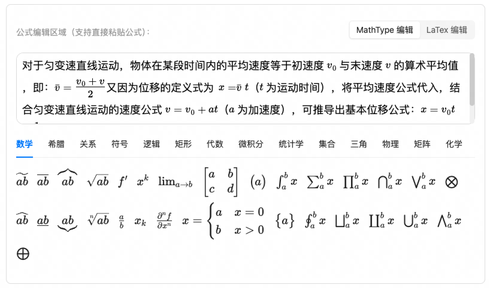

# MathType 公式编辑器

一个独立的数学公式编辑器组件，基于 React 和 Ant Design 开发，提供两种公式编辑模式：基于 MathLive 的可视化编辑和基于 LaTeX 的文本编辑。

## 特性

- 🎨 **双模式编辑**：支持 MathLive 可视化编辑和 LaTeX 文本编辑
- 🔍 **实时预览**：使用 KaTeX 进行高质量公式渲染
- 📚 **丰富公式库**：内置数学、希腊字母、关系符号等多种预设公式
- 📋 **智能粘贴**：自动处理粘贴的公式内容
- 📱 **响应式设计**：适配不同屏幕尺寸
- ⚡ **高性能**：优化的渲染和更新机制



## 安装

```bash
npm install react-mathtype-editor
```

## 使用方法

```
import React, { useState } from 'react';
import { MathEditor } from 'react-mathtype-editor';
import 'react-mathtype-editor/dist/style.css';

function App() {
  const [formula, setFormula] = useState('');

  return (
    <div>
      <MathEditor 
        defaultValue={formula}
        onChange={(value) => setFormula(value)}
        style={{ width: '100%' }}
      />
    </div>
  );
}

export default App;
```

## API

### Props

| 属性 | 类型 | 默认值 | 描述 |
|------|------|--------|------|
| defaultValue | string | '' | 默认的 LaTeX 公式 |
| onChange | (value: string) => void | - | 公式变化时的回调函数 |
| style | React.CSSProperties | - | 自定义样式 |

## 功能说明

### 编辑模式

- **MathLive 模式**：可视化公式编辑器，可以直接点击输入数学符号
- **LaTeX 模式**：纯文本编辑，直接输入 LaTeX 代码

### 公式库

提供了多个分类的预设公式，包括：
- 数学符号
- 希腊字母
- 关系符号
- 逻辑符号
- 矩阵
- 化学方程式等

### 粘贴处理

支持智能粘贴处理，能够：
- 自动识别公式和文本
- 修复不匹配的括号
- 处理混合内容（公式+文本）

## 项目架构

### 技术栈
- **前端框架**：React 17+/18+
- **UI 组件库**：Ant Design 5.x
- **公式引擎**：MathLive（编辑） + KaTeX（渲染）
- **样式处理**：Less
- **类型检查**：TypeScript

### 组件结构
```
MathEditor (主组件)
├── 模式切换区 (Segmented)
├── 编辑内容区
│   ├── MathLive 模式
│   │   └── math-field 元素
│   └── LaTeX 模式
│       ├── 输入区域 (Input.TextArea)
│       └── 预览区域 (HTML 渲染)
└── 公式库区 (Tabs)
    └── 预设公式 (KATEXLIST)
```

### 数据流
1. 用户在任一编辑模式中输入公式
2. 组件状态同步更新 LaTeX 字符串
3. 实时渲染预览
4. 通过 onChange 回调通知父组件

## 开发

### 环境搭建

```bash
# 克隆项目
git clone <repository-url>

# 安装依赖
npm install
```

### 开发模式

```bash
# 启动开发服务器
npm run dev

# 运行类型检查
npm run type-check

# 运行 ESLint 检查
npm run lint
```

### 构建发布

```bash
# 构建生产版本
npm run build
```

有关更详细的技术设计文档，请参阅 [SDD.md](./SDD.md)。

## 贡献指南

### 代码贡献
1. Fork 项目
2. 创建功能分支
3. 提交代码
4. 发起 Pull Request

### 问题报告
- 详细描述问题现象
- 提供重现步骤
- 附上错误日志或截图

## 许可证

MIT